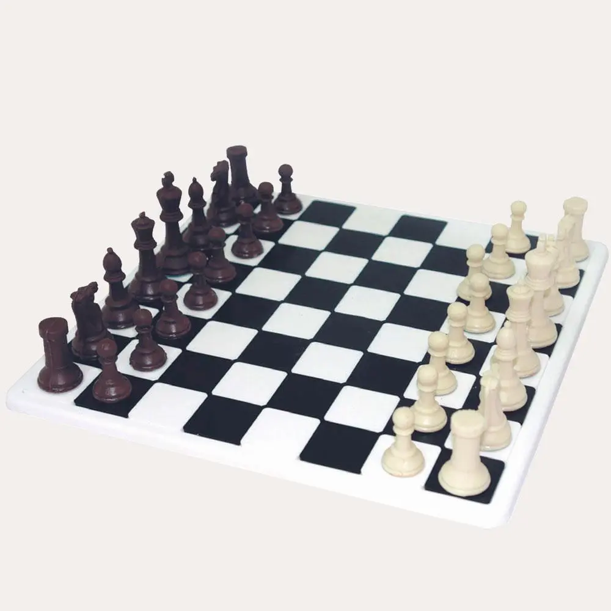

Proyecto de ajedrez HTML y CSS

<!--  -->
<!-- imagen que descargas y la pones en una carpeta en tu proyecto y lo añades en el README, sería conveniente poner una de la switc original para que se vea lo que querías conseguir y lo que has conseguido, para que no tengan que ir a internet a buscarlo. -->
